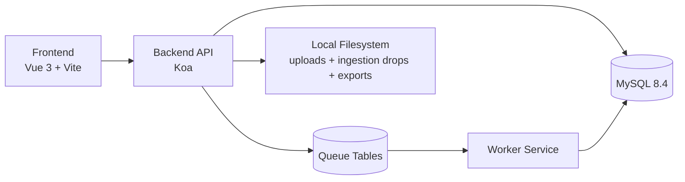

# TrailForge Design Document

## 1. Purpose

This document describes the current TrailForge system design as implemented in this project.  
TrailForge is an offline-ready sports training and community platform with role-based workflows for `user`, `coach`, `support`, and `admin`.

## 2. System Goals

- Provide a unified local web app for feed, training activities, commerce, reviews, disputes, and operations.
- Enforce role-based permissions consistently across UI routes and backend APIs.
- Maintain operational reliability through queue/worker processing and auditable logs.
- Support offline-friendly UX with controlled client persistence and service-worker caching boundaries.

## 3. High-Level Architecture

### Runtime Services

- `frontend` (port `5173`): Vue application with role-aware routing.
- `backend` (port `3000`): Koa APIs, auth/RBAC, domain services, validation, auditing.
- `mysql` (port `3306`): system of record for core entities.
- `worker`: background processing for queue/operational jobs.

## 4. Backend Design

### 4.1 Module-Oriented Structure

Backend modules are domain-based and separated into route/schema/service layers:

- `auth`, `users`
- `feed`, `follows`
- `activities`, `places`, `gpx`
- `catalog`, `orders`, `payments`
- `reviews` (user, staff, governance, risk/moderation)
- `ingestion`
- `analytics`
- `admin`, `queue`

### 4.2 Cross-Cutting Middleware

- `error-handler`: standardized API error envelope and request correlation.
- `validate`: Zod schema validation for body/query/params.
- `auth` + `requireRole`: session auth and RBAC guards.
- `auth-rate-limit` and `rate-limit`: abuse/rate controls.
- `request-id`: request traceability in logs.

### 4.3 Security Model

- Local auth with username/password.
- Passwords hashed with bcrypt.
- Session tokens generated randomly and stored as hashes.
- Profile-sensitive fields encrypted at rest (AES-256-GCM).
- Helmet headers + controlled CORS.
- Review image upload controls: MIME allowlist, size cap, hash denylist.

## 5. Frontend Design

### 5.1 Route and Role Model

Shared authenticated pages:

- `/`, `/catalog`, `/orders`, `/reviews`, `/reviews/new`
- `/activities`, `/activities/new`, `/activities/:activityId/edit`
- `/settings`, `/onboarding/interests`

Role-gated pages:

- `/staff/cases` -> `coach`, `support`, `admin`
- `/admin/analytics` -> `support`, `admin`
- `/admin/ops` -> `admin`

### 5.2 UI/State Patterns

- Role-aware nav and route guards driven by authenticated user roles.
- Optimistic interactions for feed actions with rollback on API failure.
- Toast-based user feedback for command results.
- Domain-specific pages (orders, reviews, activities, analytics, admin ops).

### 5.3 Offline Strategy

- Service worker caches app shell/static assets.
- Private authenticated API responses are not broadly cached in service worker.
- Client persistence stores bounded feed snapshots/preferences.
- Private data isolation clears persisted state on session/account transitions.

## 6. Core Domain Workflows

### 6.1 Feed and Preference Loop

1. User logs in and session initializes.
2. If no preferred sports, router redirects to onboarding interests.
3. Feed loads personalized items.
4. User can apply `not interested`, `block author`, `block tag` actions.

### 6.2 Activities and GPX

1. User manages places.
2. User creates/edits activities with metrics and notes.
3. User uploads GPX payload.
4. Coordinates are parsed and available for list-based viewing.

### 6.3 Reviews, Appeals, and Staff Cases

1. User posts one review per completed order.
2. Follow-up allowed within policy window.
3. User can submit appeal within policy window.
4. Staff (`coach/support/admin`) reviews appeals and updates statuses.
5. Arbitration state controls review/image visibility.

### 6.4 Payments and Operational Safety

1. Orders are created and tracked by status.
2. Reconciliation imports can be submitted by support/admin.
3. Refunds are role-restricted to support/admin with idempotency semantics.
4. Queue/worker routines support retries and operational sweeps.

### 6.5 Analytics and Auditability

1. Support/admin access analytics dashboard and report views.
2. CSV exports are generated by report type + filters.
3. Export access is logged for audit traceability.

## 7. Data and Persistence (High-Level)

Core persistent areas include:

- Identity and RBAC (`users`, `roles`, `sessions`, `profiles`)
- Feed and follows
- Activities/places/coordinates
- Catalog/orders/payments/refunds/ledger-like records
- Reviews/images/replies/appeals/moderation/risk
- Ingestion sources and immutable-style logs
- Analytics snapshots and export access logs

## 8. Observability and Reliability

- Structured request logging with request IDs and timing.
- Standardized success/error response contracts.
- Domain-level audit events for key actions (auth, review, appeal, etc.).
- Worker pattern for operational decoupling and retry workflows.

## 9. Assumptions and Constraints

- Designed for local/offline-capable deployment (single-host style operations).
- Uses local credentials and seeded role accounts for development verification.
- Some advanced operational capabilities are backend/admin heavy by design.

## 10. Non-Goals (Current Scope)

- Public cloud-native multi-tenant orchestration.
- External identity provider integration.
- Real-time map rendering for GPX (coordinates are list-focused in current scope).
